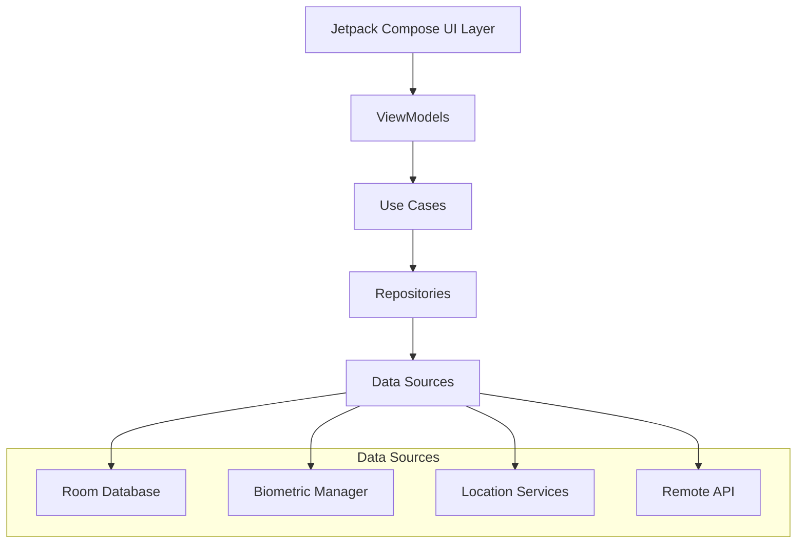
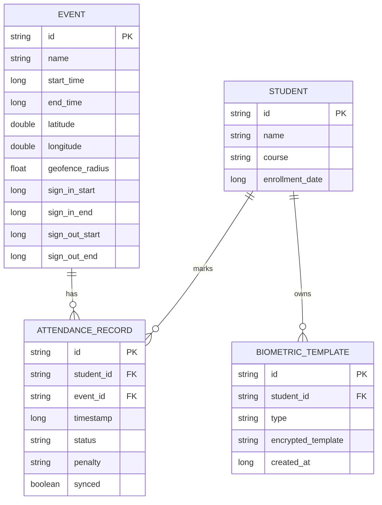

# Design Document

## Overview

The Biometric Attendance System is designed as an offline-first Android application using modern Android development practices. The architecture follows Clean Architecture principles with MVVM pattern, ensuring separation of concerns and testability. The system leverages AndroidX BiometricPrompt for native biometric authentication, Google Play Services for geo-fencing, Room database for local storage, and Jetpack Compose for the UI.

## Architecture

### High-Level Architecture



### Layer Responsibilities

- **UI Layer**: Jetpack Compose screens and components
- **Presentation Layer**: ViewModels managing UI state and user interactions
- **Domain Layer**: Use cases containing business logic
- **Data Layer**: Repositories coordinating between local and remote data sources

## Components and Interfaces

### Core Components

#### 1. Authentication Module
```kotlin
interface BiometricAuthenticator {
    suspend fun authenticate(): AuthResult
    suspend fun enrollBiometric(userId: String): EnrollmentResult
    fun isAvailable(): BiometricCapability
}

interface FaceDetectionService {
    suspend fun detectFace(imageData: ByteArray): FaceDetectionResult
    suspend fun verifyLiveness(imageData: ByteArray): LivenessResult
}
```

#### 2. Location Module
```kotlin
interface GeofenceManager {
    suspend fun createGeofence(eventId: String, location: LatLng, radius: Float)
    suspend fun isWithinGeofence(eventId: String, currentLocation: LatLng): Boolean
    suspend fun removeGeofence(eventId: String)
}

interface LocationProvider {
    suspend fun getCurrentLocation(): Location?
    fun startLocationUpdates(callback: LocationCallback)
    fun stopLocationUpdates()
}
```

#### 3. Data Storage Module
```kotlin
@Entity
data class Student(
    @PrimaryKey val id: String,
    val name: String,
    val course: String,
    val biometricTemplate: String, // Encrypted
    val enrollmentDate: Long
)

@Entity
data class Event(
    @PrimaryKey val id: String,
    val name: String,
    val startTime: Long,
    val endTime: Long,
    val location: LatLng,
    val geofenceRadius: Float,
    val signInWindow: TimeWindow,
    val signOutWindow: TimeWindow
)

@Entity
data class AttendanceRecord(
    @PrimaryKey val id: String,
    val studentId: String,
    val eventId: String,
    val timestamp: Long,
    val status: AttendanceStatus,
    val penalty: PenaltyType?,
    val synced: Boolean = false
)
```

#### 4. Sync Module
```kotlin
interface SyncManager {
    suspend fun syncAttendanceRecords(): SyncResult
    suspend fun syncStudentData(): SyncResult
    suspend fun syncEventData(): SyncResult
    fun schedulePeriodicSync()
}
```

### Security Components

#### Encryption Service
```kotlin
interface EncryptionService {
    suspend fun encryptBiometricData(data: ByteArray): EncryptedData
    suspend fun decryptBiometricData(encryptedData: EncryptedData): ByteArray
    fun generateSecretKey(): SecretKey
}
```

#### Security Manager
```kotlin
interface SecurityManager {
    fun isDeviceSecure(): Boolean
    fun detectRootAccess(): Boolean
    fun validateAppIntegrity(): Boolean
    suspend fun logSecurityEvent(event: SecurityEvent)
}
```

## Data Models

### Core Entities

#### User Roles
```kotlin
enum class UserRole {
    STUDENT, ADMIN
}

data class User(
    val id: String,
    val name: String,
    val role: UserRole,
    val biometricEnabled: Boolean
)
```

#### Attendance Management
```kotlin
enum class AttendanceStatus {
    PRESENT, LATE, ABSENT, EXCUSED
}

enum class PenaltyType {
    WARNING, MINOR, MAJOR, CRITICAL
}

data class TimeWindow(
    val startOffset: Long, // Minutes before event start
    val endOffset: Long    // Minutes after event start
)
```

#### Biometric Data
```kotlin
data class BiometricTemplate(
    val userId: String,
    val type: BiometricType,
    val encryptedTemplate: String,
    val createdAt: Long
)

enum class BiometricType {
    FINGERPRINT, FACE
}
```

### Database Schema



## Error Handling

### Error Categories

#### 1. Biometric Errors
```kotlin
sealed class BiometricError : Exception() {
    object HardwareUnavailable : BiometricError()
    object NoEnrolledBiometrics : BiometricError()
    object AuthenticationFailed : BiometricError()
    object UserCancelled : BiometricError()
    object TooManyAttempts : BiometricError()
}
```

#### 2. Location Errors
```kotlin
sealed class LocationError : Exception() {
    object PermissionDenied : LocationError()
    object LocationDisabled : LocationError()
    object OutsideGeofence : LocationError()
    object LocationUnavailable : LocationError()
}
```

#### 3. Sync Errors
```kotlin
sealed class SyncError : Exception() {
    object NetworkUnavailable : SyncError()
    object ServerError : SyncError()
    object AuthenticationExpired : SyncError()
    data class ConflictError(val conflicts: List<DataConflict>) : SyncError()
}
```

### Error Recovery Strategies

1. **Biometric Failures**: Provide alternative authentication methods and clear user guidance
2. **Location Issues**: Show helpful messages and guide users to enable location services
3. **Sync Failures**: Implement exponential backoff with retry mechanisms
4. **Database Errors**: Implement data integrity checks and recovery procedures

## Testing Strategy

### Unit Testing
- **Domain Layer**: Test all use cases with mock dependencies
- **Data Layer**: Test repository implementations and database operations
- **Utilities**: Test encryption, validation, and helper functions

### Integration Testing
- **Biometric Integration**: Test with Android Test Framework using mock biometric responses
- **Location Services**: Test geofence calculations and location accuracy
- **Database Operations**: Test Room database with in-memory database
- **Sync Operations**: Test with mock server responses

### UI Testing
- **Compose Testing**: Test UI components and user interactions
- **Navigation Testing**: Verify correct screen transitions
- **Accessibility Testing**: Ensure proper content descriptions and navigation

### Security Testing
- **Encryption Testing**: Verify data encryption/decryption cycles
- **Biometric Security**: Test against spoofing attempts
- **Data Integrity**: Verify tamper detection mechanisms

### Performance Testing
- **Database Performance**: Test with large datasets (1000+ records)
- **Biometric Response Time**: Ensure authentication completes within 3 seconds
- **Location Accuracy**: Test geofence precision within 5-meter tolerance
- **Memory Usage**: Monitor for memory leaks during extended usage

### End-to-End Testing
- **Attendance Flow**: Complete student check-in/check-out scenarios
- **Admin Workflows**: Event creation, student enrollment, report generation
- **Offline Scenarios**: Test full functionality without network connectivity
- **Sync Scenarios**: Test data synchronization after offline usage